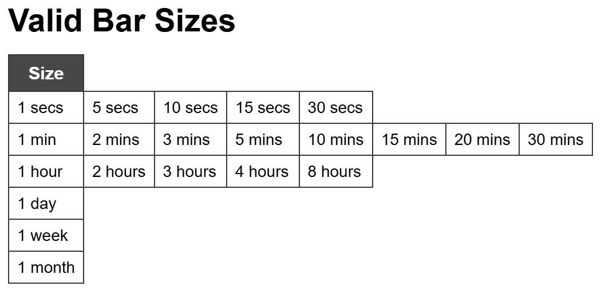
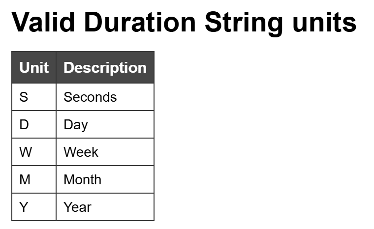
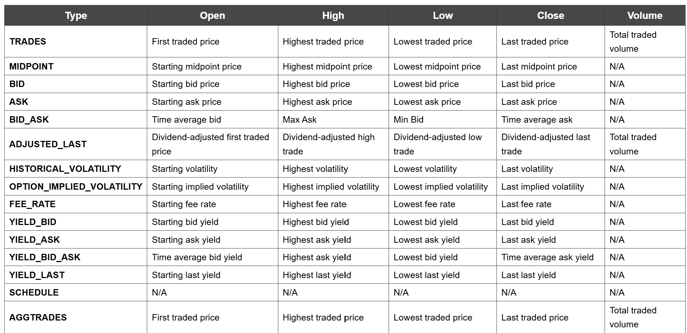
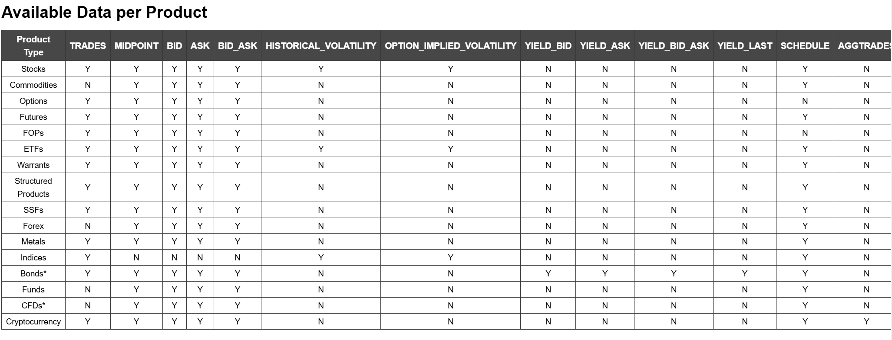

# ibkr_algo
Provides a template to read a list of assets saved in excel and process

# Excel file field
Reference to https://interactivebrokers.github.io/tws-api/historical_bars.html:

barsize: time frame, e.g. 30 min, hourly daily chart etc,   
  
duration: how many historical bars to read from the current time e.g. 5 days, 1 Y etc   
  
history_end_dt: this is not use currently as it always end at current time  
whatToShow:  
  
  

